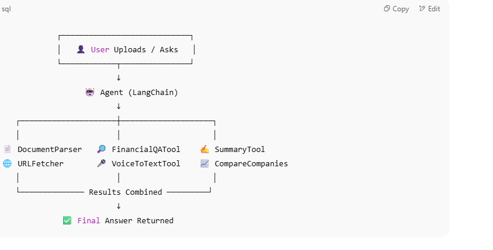

# 🧠 FinPilot – AI-Powered Financial Assistant

FinPilot is an intelligent financial co-pilot powered by local LLMs via LangChain and Ollama. It helps users:

- ✅ Answer questions from financial documents
- ✅ Compare two companies using retrieved insights
- ✅ Perform financial ratio analysis
- ✅ Summarize financial reports and text
- ✅ Read results aloud using a voice agent (TTS)
- ✅ Use tools in a multi-agent reasoning workflow

---

## 🧩 Architecture Overview



---

## ✅ Completed Features

| Feature                          | Status  |
|----------------------------------|---------|
| Financial Q&A via RAG            | ✅ Done |
| Compare two companies            | ✅ Done |
| Summarize financial reports      | ✅ Done |
| Extract insights from PDFs       | ✅ Done |
| Perform ratio analysis           | ✅ Done |
| Voice synthesis (TTS)            | ✅ Done |
| Agent orchestration              | ✅ Done |
| Multi-step reasoning             | ✅ Done |
| Real-time CLI interface          | ✅ Done |

---

## 🚧 Work in Progress (For PoC Completion)

| Task / Feature                                       | Status       |
|------------------------------------------------------|--------------|
| Handle OutputParserException (`handle_parsing_errors=True`) | ✅ Done |
| Replace deprecated LangChain imports (≥ 0.2)         | ⚠️ In Progress |
| Add robust fallback/retry logic                      | 🕓 Future |
| Add UI upload / file API                             | 🕓 Future |
| Add memory for context tracking                      | 🕓 Future |
| Web interface (Streamlit/Gradio)                     | 🔜 Optional |
| Real-time stock data integration                     | 🔜 Optional |

---

## 🏗️ Updated Project Structure

```
FinPilot/
├── app/
│   ├── __init__.py
│   ├── agent_setup.py
│   ├── get_embedding_function.py
│   ├── load_data.py
│   ├── main_tools.py
│   └── tools/
│       ├── comparecompanies_tool.py
│       ├── financialqa_tool.py
│       ├── pdfretriever.py
│       ├── pdfretriver_tool.py
│       ├── qa_tool.py
│       ├── ratioanalysis_tool.py
│       ├── summarizer_tool.py
│       ├── test_compare.py
│       ├── urlscraper_tool.py
│       └── voice_tool.py
├── .gitignore
├── README.md
├── architecture.png
├── agentic_copilot.ipynb
├── requirements.txt
```

---

## 💻 Installation & Usage

### 🔧 Setup

```bash
git clone https://github.com/yourname/finpilot.git
cd finpilot

# Create and activate virtual environment
python -m venv .venv
.venv\Scripts\activate     # On Windows
# OR
source .venv/bin/activate  # On macOS/Linux

# Install dependencies
pip install -r requirements.txt
```

### 🚀 Run the Agent

```bash
python -m app.agent_setup
```

You’ll see:
```
🔁 Waiting for your input...
Ask your financial assistant:
```

---

## 👨‍💻 Author

Built by Sitarama
